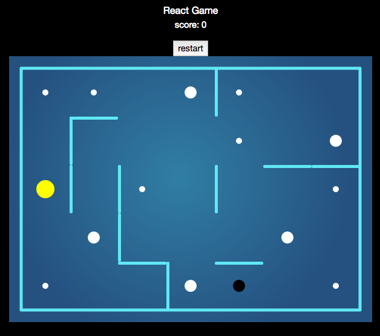

# A little React Game with Canvas (under development)

## Usage

Install modules to app

    npm install

Run the app in the development mode in [http://localhost:3000](http://localhost:3000).

    npm start

## Build for production

Build the app for production to the `build` folder. It bundles React in production mode and optimizes the build for the best performance. App is ready to be deployed.

    npm run build

## To Do
- [ ] linear moving

## Technology

* Create with : [Creat React App](https://github.com/facebookincubator/create-react-app)
* JS frameworks : ReactJS
* CSS frameworks : BootStrap-v4
* Lint: ESLint
* Editor: Atom
